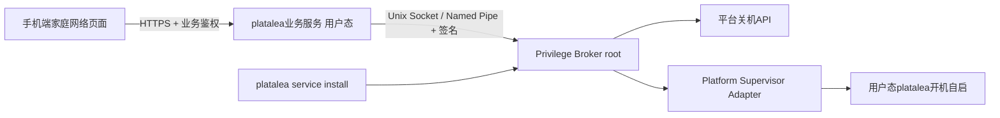
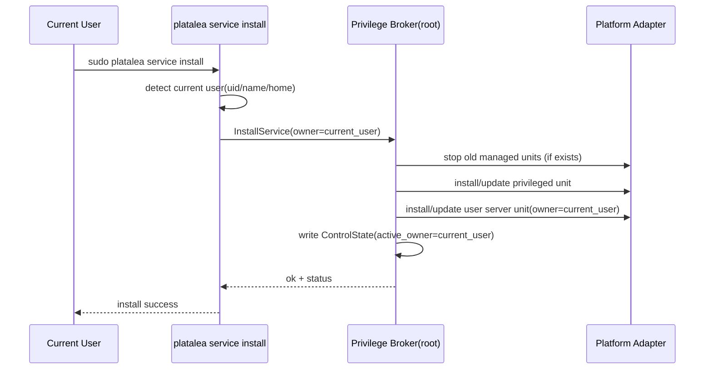
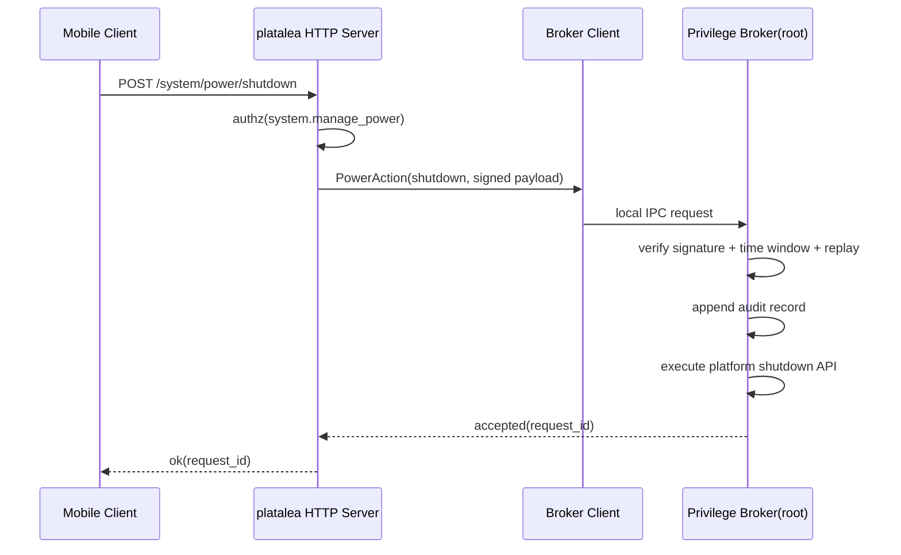

# 跨平台服务控制面设计文档

## 1. 设计目的

### 1.1 背景

当前 `platalea` 的 PC 服务主要按用户会话运行，适合日常调试，但对于无头主机（如家中 Mac mini）存在两个长期痛点：

1. 主机重启后，服务不能稳定自动拉起。
2. 远程执行关机通常依赖 SSH + sudo，不便维护且安全边界不清晰。

### 1.2 本设计目标

本设计在现有家庭留言板服务基础上，新增一个“服务控制面”，满足以下目标：

1. 支持安装/卸载“系统服务”，实现开机自动拉起 `platalea`。
2. 支持受控远程关机能力，但不让手机端或 `platalea` 主服务持有 sudo 密码。
3. 面向未来多平台（macOS / Linux / Windows）扩展，不把架构逻辑绑定在某一平台。
4. 单机只允许一个生效实例，避免端口冲突。
5. 安装时默认使用“当前执行 `platalea service install` 的用户”作为业务服务用户，不允许用户手工指定。
6. 若两个用户先后安装，后安装者覆盖前安装者。
7. 提供完整卸载命令，在不需要时移除 root 控制面，降低攻击面。

### 1.3 设计基线

本设计基于 2026-07-09 的代码状态，核心入口位于：

1. [pc_tools/platalea/cli.py](pc_tools/platalea/cli.py)
2. [pc_tools/platalea/cli.py](pc_tools/platalea/cli.py)
3. [pc_tools/config.example.json](pc_tools/config.example.json)

## 2. 设计逻辑

### 2.1 核心取舍

核心问题不是“如何执行关机命令”，而是“如何在不扩散 root 密码的前提下提供受控系统能力”。

设计取舍如下：

1. 不采用“手机传 sudo 密码给 `platalea`”。
2. 引入双进程模型：
   1. 业务服务（非 root）：现有 `platalea` HTTP 服务。
   2. 特权代理（root）：仅处理白名单系统动作。
3. 业务服务不直接提权，仅通过本机 IPC 请求特权代理。

### 2.2 新概念

为避免平台耦合，本设计引入三个新概念：

1. `Control Plane`（控制面）：
   负责安装、卸载、状态检查、系统动作请求路由。
2. `Privilege Broker`（特权代理）：
   root 进程，仅执行白名单动作，如 shutdown/reboot，拒绝任意 shell。
3. `Platform Supervisor Adapter`（平台监管器适配层）：
   抽象不同平台服务管理机制（launchd/systemd/Windows Service）。

### 2.3 总体流程



### 2.4 平台策略

1. 通用层：命令语义、ownership 规则、覆盖规则、审计规则一致。
2. 平台层：
   1. macOS 使用 launchd。
   2. Linux 使用 systemd。
   3. Windows 使用 Service Control Manager（后续）。

### 2.5 单机单实例与覆盖规则

定义“激活所有者（active owner）”概念，保存于 root 侧状态文件（例如 `/var/lib/platalea-control/owner.json`，平台可映射到等价目录）。

规则：

1. `service install` 总是以当前用户为 owner（通过真实 uid/gid 识别）。
2. 若已有 owner 且与当前用户不同：
   1. 停止旧 owner 的业务服务自启项。
   2. 更新 owner 为当前用户。
   3. 重建/重写平台服务定义并拉起新 owner 的业务服务。
3. 单机仅保留一个业务服务监听配置（端口唯一来源仍为当前 config）。

## 3. 核心数据结构

### 3.1 控制面状态

```json
{
  "schema_version": 1,
  "active_owner": {
    "uid": 501,
    "username": "kenny",
    "home": "/Users/kenny"
  },
  "installed_at": 1760000000,
  "platform": "macos",
  "service_revision": 3,
  "managed_units": {
    "privileged": "com.localmanager.platalea.privileged",
    "user_server": "com.localmanager.platalea.server"
  }
}
```

### 3.2 特权请求结构

```json
{
  "op": "shutdown",
  "request_id": "uuid",
  "requested_by": "board_admin",
  "requested_at": 1760000123,
  "nonce": "random",
  "hmac": "hex"
}
```

### 3.3 审计日志结构

```json
{
  "ts": 1760000123,
  "actor": "board_admin",
  "source": "192.168.8.20",
  "action": "shutdown",
  "result": "allowed",
  "owner_uid": 501
}
```

## 4. 接口定义

### 4.1 CLI 接口（通用）

1. `platalea service install`
   1. 行为：安装控制面与开机自启。
   2. 身份：当前执行用户自动作为 owner。
   3. 权限：需要 sudo（仅安装阶段）。

2. `platalea service uninstall`
   1. 行为：移除控制面与托管服务定义，停止相关服务。
   2. 权限：需要 sudo。

3. `platalea service status`
   1. 行为：展示 owner、平台后端、服务状态、最近审计摘要。
   2. 权限：普通用户可读，敏感字段脱敏。

4. `platalea power shutdown`
   1. 行为：由业务服务向特权代理发起关机请求。
   2. 权限：要求业务侧“系统管理权限”角色校验通过。

### 4.2 HTTP 接口（业务服务）

1. `POST /system/power/shutdown`
   1. 对外仅暴露业务语义。
   2. 业务服务内部转发到本机特权代理。
   3. 返回请求接受结果与审计编号。

2. `GET /system/service/status`
   1. 返回控制面安装状态、active owner、平台后端健康状态。

### 4.3 IPC 接口（业务服务 -> 特权代理）

1. `InstallService(owner_uid, owner_username, owner_home, server_exec, config_path)`
2. `UninstallService()`
3. `PowerAction(shutdown|reboot, metadata)`
4. `QueryStatus()`

说明：

1. `server_exec` 必须由安装时自动探测，不允许用户自由输入，防止路径注入。
2. 所有 IPC 请求必须带签名和时间窗校验，避免重放。

## 5. 一致性校验

### 5.1 概念一致性

1. 控制面负责“生命周期与策略”。
2. 特权代理负责“受限系统动作”。
3. 业务服务负责“网络接口与业务鉴权”。

三者职责边界清晰，没有层次混杂。

### 5.2 状态完备性

关键状态：

1. 未安装。
2. 已安装且运行。
3. 已安装但业务服务异常。
4. 覆盖安装进行中。
5. 卸载进行中。

每个状态均有可恢复路径：install/status/reinstall/uninstall。

### 5.3 接口完备性

1. 安装、卸载、状态、关机四类需求均有对应接口。
2. “后装覆盖前装”通过 install 幂等实现，不需要额外迁移命令。

### 5.4 安全与可维护性

1. 不传递 sudo 密码。
2. root 面仅本机 IPC，不暴露公网。
3. 白名单命令执行，拒绝任意命令。
4. 可卸载根服务，满足最小暴露面。

## 6. 分阶段落地

### Phase 1（优先，macOS 首发）

1. 实现平台抽象接口与 macOS launchd 适配层。
2. 完成 `service install/uninstall/status`。
3. 完成 `power shutdown` 链路（业务鉴权 -> IPC -> 特权代理）。

### Phase 2（Linux）

1. 接入 systemd 适配层。
2. 对齐 owner 覆盖规则与状态模型。

### Phase 3（Windows）

1. 接入 Windows 服务管理器。
2. 对齐 IPC 鉴权、审计与卸载策略。

## 7. 变更历史

| 日期 | 变更内容 | 原因 |
| --- | --- | --- |
| 2026-07-09 | 初版设计，定义跨平台控制面、owner 覆盖规则、可卸载策略 | 支持无头主机自动启动与受控关机 |

## 8. Phase 1 实现细化（可直接编码）

### 8.1 模块拆分

新增模块建议如下（先实现 macOS 后端，抽象层保持平台无关）：

1. `pc_tools/platalea/service_control/models.py`
   1. 定义控制面核心数据结构：`ControlState`、`InstallRequest`、`PowerRequest`。
2. `pc_tools/platalea/service_control/broker_client.py`
   1. 业务服务与 CLI 访问特权代理的 IPC 客户端。
3. `pc_tools/platalea/service_control/broker_server.py`
   1. 特权代理入口，处理白名单操作并写审计。
4. `pc_tools/platalea/service_control/platform/base.py`
   1. 平台监管器抽象接口 `PlatformSupervisorAdapter`。
5. `pc_tools/platalea/service_control/platform/macos_launchd.py`
   1. macOS launchd 适配实现（安装、卸载、状态查询）。
6. `pc_tools/platalea/service_cmd.py`
   1. `platalea service install/uninstall/status` 命令处理。
7. `pc_tools/platalea/power_cmd.py`
   1. `platalea power shutdown` 命令处理。

### 8.2 CLI 接口增量

在现有 CLI 增加两个分组：

1. `platalea service install`
2. `platalea service uninstall`
3. `platalea service status`
4. `platalea power shutdown`

约束：

1. `service install` 不接受 `--user` 参数。
2. install 期间自动解析当前用户 uid/username/home。
3. 再次 install 视为覆盖安装，幂等执行。

### 8.3 平台抽象接口草案

```python
class PlatformSupervisorAdapter(Protocol):
    def install_privileged_unit(self, spec: PrivilegedUnitSpec) -> None:
        """安装并启用 root 特权代理服务。"""

    def install_user_server_unit(self, spec: UserServerUnitSpec) -> None:
        """安装并启用 owner 用户态业务服务。"""

    def uninstall_all_units(self, *, ignore_missing: bool = True) -> None:
        """卸载控制面及托管服务。"""

    def restart_user_server_unit(self) -> None:
        """重启 owner 的业务服务。"""

    def query_status(self) -> SupervisorStatus:
        """返回平台服务状态摘要。"""

    def run_power_action(self, action: PowerAction) -> None:
        """执行白名单系统动作（shutdown/reboot）。"""
```

### 8.4 关键路径时序

#### 8.4.1 安装（覆盖安装语义）



#### 8.4.2 远程关机



### 8.5 配置与状态文件

Phase 1 最小文件集合：

1. 控制面状态：`<platform_state_root>/platalea-control/state.json`
2. 控制面密钥：`<platform_state_root>/platalea-control/ipc_secret`
3. 审计日志：`<platform_state_root>/platalea-control/audit.log`

约束：

1. `ipc_secret` 权限必须限制为 root 可读写。
2. 审计日志不能写入请求中的敏感明文（如密码、token）。

### 8.6 错误码与可观测性

新增统一错误码（示例）：

1. `SERVICE_NOT_INSTALLED`
2. `SERVICE_ALREADY_INSTALLED`
3. `OWNER_REPLACED`
4. `POWER_NOT_ALLOWED`
5. `BROKER_UNREACHABLE`
6. `PLATFORM_BACKEND_ERROR`

日志要求：

1. CLI 输出给出明确下一步建议。
2. HTTP 返回 `request_id`，便于在审计日志追踪。
3. install/uninstall/status 的失败信息包含平台命令标准错误摘要。

### 8.7 最小验收清单

Phase 1 完成判定：

1. 执行 install 后，主机重启可自动拉起 platalea 服务。
2. 同机另一用户执行 install，旧 owner 被覆盖，且只有新 owner 服务生效。
3. 执行 uninstall 后，root 控制面和托管单元均移除。
4. 远程触发 shutdown 仅在具备系统管理权限时成功。
5. `status` 能显示 owner、平台后端状态、最近一次特权动作摘要。

### 8.8 测试计划

1. 单元测试：
   1. owner 覆盖判定。
   2. IPC 签名与重放保护。
   3. 状态文件读写幂等。
2. 集成测试（macOS）：
   1. install -> reboot -> status。
   2. 多用户 install 覆盖流程。
   3. uninstall 清理完整性。
3. 安全测试：
   1. 未鉴权请求触发 shutdown 必须失败。
   2. 非白名单 action 必须拒绝。
   3. 篡改签名请求必须拒绝。
