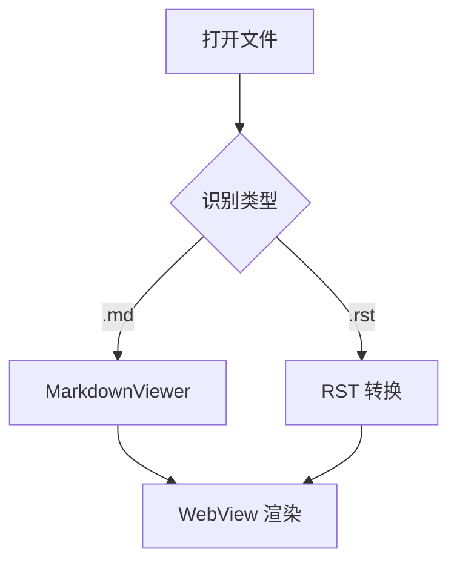
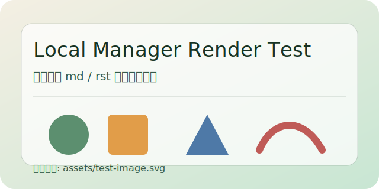

# Markdown 渲染测试

这个文件用于验证本地管家的 Markdown 渲染能力。

## 基本格式

- 普通列表项
- **粗体**、*斜体*、~~删除线~~
- 删除线和下标混合：~~这是删除线~~，H~2~O 是下标
- `行内代码`
- Typora 风格上标：2^10^ 和 x^2^
- Typora 风格下标：H~2~O 和 CO~2~
- 上标测试：H<sup>2</sup>O
- 下标测试：CO<sub>2</sub>

## 任务列表

- [x] 已完成事项
- [ ] 未完成事项

## 表格

| 功能 | 预期 | 说明 |
| --- | --- | --- |
| 标题 | 正常显示 | 支持多级标题 |
| 表格 | 有边框 | 来自 commonmark 表格扩展 |
| 脚注 | 可跳转 | 页面内锚点 |

## 代码高亮

```kotlin
data class Person(val name: String, val age: Int)

fun greeting(person: Person): String {
    return "你好，${person.name}，你今年 ${person.age} 岁。"
}
```

```python
def add(a: int, b: int) -> int:
    return a + b

print(add(2, 3))
```

```json
{
  "name": "local-manager",
  "feature": ["markdown", "rst", "code-highlight"]
}
```

## 数学公式

行内公式：$a^2 + b^2 = c^2$

块公式：

$$
\int_0^1 x^2\,dx = \frac{1}{3}
$$

## Mermaid



## 本地链接与图片

- 跳转到 [Markdown 子页面](details.md)
- 跳转到 [RST 首页](index.rst)



## 脚注

这里有一个 Markdown 脚注示例。[^md-note]

这里再补一个数字脚注示例。[^1]

这里补一个带字母前缀的脚注示例。[^n1]

[^md-note]: 这是 Markdown 脚注内容，用来验证页面内脚注展示。
[^1]: 这是数字脚注内容，用来验证 `[^1]` 这种写法是否能被正确解析和展示。
[^n1]: 这是字母前缀脚注内容，用来验证它不会和数字脚注的内部映射冲突。